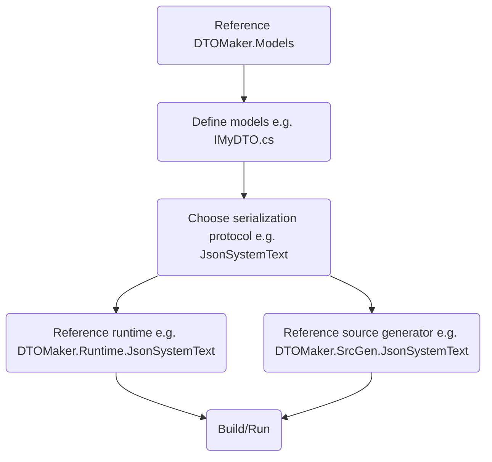

# DTOMaker-V2

*Note: This is the maintenance repo for V2.x*

[](https://github.com/datafac/dtomaker-v2/actions/workflows/dotnet.yml)


This repo contains model-driven compile-time source generators for quickly creating 
and maintaining polymorphic, immutable DTOs (Data Transport Objects) supporting various
serialization protocols.

The objective of these generators is to improve developer productivity, saving time and 
reducing errors incurred maintaining boilerplate DTO code, by allowing developers to focus
on the more interesting data model design, rather than on coding the implementations.

## Features

All DTOs created by these generators support the following features:
- Common interfaces: Models are defined as C# interfaces. As each implementation has constructors
  that accept these interfaces, different implementations can be used interchangeably, allowing 
  simple conversion between different serialization formats.
- Immutability/Freezability: Newly created instances are mutable until frozen. Once frozen, 
  instances become immutable and can be safely shared across threads without locking. 
- Backward compatibility: New properties can be added to models without breaking backward 
  compatibility. Older versions of the DTOs will simply ignore new properties.
- Polymorphism: Model types are defined as interfaces that can inherit from other interfaces. This 
  allows for polymorphic types, where a property of a base type can hold instances of derived 
  types.
- Incremental serialization: When serializing an object graph, only the parts of the graph 
  that have changed since the last serialization need to be re-serialized. This can significantly 
  improve performance when working with large object graphs where only a small portion of 
  the data changes between serializations. [Note: This feature is only supported by
  the MemBlox2 generator.]
- Built-in type support: Most .NET primitive types are supported out of the box, including 
  integers, floats, strings, Guid, etc. Raw byte arrays are supported using the built-in 
  Octets type. Other common types such as DateTime, DateTimeOffset, TimeSpan are supported 
  by built-in converters. All types can be nullable.
- Custom type support: User-defined value types can be supported via user-defined converters 
  to built-in types. For example, a custom type representing a 3D point could be converted 
  to and from a built-in type such as a tuple of three floats.

## Serialization Protocols
The following serialization protocols are supported via separate source generators and runtime 
libraries. You can choose which ones to use by referencing the appropriate source generator 
and runtime library in your project.
  - JSON (System.Text.Json)
  - JSON (Newtonsoft.Json)
  - MessagePack 2.x
  - MemBlox2 (a custom binary format optimised for incremental serialization)

## Collection Support
Collection types - arrays, lists, dictionaries, etc. - are not natively supported. However, there is an
additional package, DTOMaker.Models.BinaryTree, providing interfaces and extension methods that allow
you to define collections based on balanced binary trees.

The ability to model collections natively, with incremental serialization support, is being developed in V3.x.

## Example

```C#
using DTOMaker.Models;
namespace MyModels;
[Entity(1)] public interface INode : IEntityBase
{
    [Member(1)] String Key { get; set; } 
}
[Entity(2)] public interface IStringNode : INode
{
    [Member(1)] String Value { get; set; } 
}
[Entity(3)] public interface INumberNode : INode
{
    [Member(1)] Int64 Value  { get; set; } 
}
[Entity(4)] public interface ITree : IEntityBase
{
    [Member(1)] ITree? Left  { get; set; }
    [Member(2)] ITree? Right { get; set; }
    [Member(3)] INode? Node  { get; set; }
}
```

## Workflow


## Open Source Declaration

This is an open source project. This means that you are free to use the source code
and released binaries within the terms of the license. Use of such constitutes agreement
to the license terms.

This project is maintained by unpaid developers who enjoy doing this. Please remember that 
developers are ordinary people, probably much like you, that have families, homes, vehicles 
and other everyday expenses.

If you find this project useful in any way, including generating revenue for your
organisation, we ask that you consider sponsoring this project financially. We leave
it up to you to decide how much. Any amount is appreciated.

You can [contribute via GitHub Sponsors](https://github.com/sponsors/Psiman62).

## Coming in V3.x
- Breaking changes.
- Incremental serialization (IPackable support) for all DTOs
- Generators for records and plain classes
- MessagePack 3.x generator
- ref type converters
- more collection types
- Orleans generator
- Protobuf.Net generator

# License
This project is licensed under the Apache-2.0 License - see the [LICENSE](LICENSE) file for details.

## Miscellaneous
- This readme was last updated 9th July 2026.
